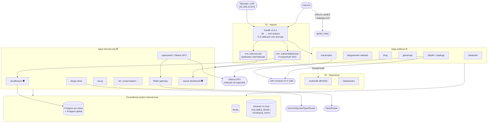

# 🍊 Bergatrix — Visão Geral

> Documento mestre do homelab **Bergatrix** (servidor **BergaServer**). Ponto de entrada do conhecimento para evoluir e manter a infraestrutura.

## O que é
A Bergatrix é um **monorepo de homelab self-hosted** organizado por **camadas numeradas em ordem de dependência**, cada uma contendo stacks Docker Compose independentes. Pilares declarados:

- **Soberania de dados / desgooglificação** — reduzir dependência de serviços de terceiros via self-hosting e open source.
- **Security by design** — hardening, isolamento de rede, defesa em profundidade (alinhado aos estudos para ISC2 CC e CompTIA Security+).
- **Modularidade** — *uma stack = uma pasta = um `docker-compose.yml` + `.env.example`*; cada stack sobe isolada, sem orquestrador central.

**Mantenedor:** Lucas (Analista de Marketing no Clube do Valor → transição para Cybersecurity, jul/2026). **Idioma do projeto:** PT-BR. **Licença:** MIT.

## Camadas (ordem de dependência 00 → 04)

| Ordem | Camada | Função | Stacks |
|:---:|---|---|---|
| **00** | `infrastructure` | Base de dados/admin | `networks` (runbook de redes), `cloudbeaver` (console DB) |
| **01** | `network` | Ingress e TLS | `traefik` (reverse proxy central) |
| **02** | `security` | Identidade e segredos | `authentik` (SSO/IdP), `bitwarden` (Vaultwarden) |
| **03** | `apps` | Aplicações | 11 stacks (mídia, IA, automação, RSS, streaming, utilidades) |
| **04** | `monitoring` | Observabilidade de segurança | `wazuh` (SIEM/XDR) |

A numeração reflete a dependência real: **as redes e o Traefik (01) precisam existir antes** das apps (03); o **Authentik (02)** expõe o middleware `authentik@docker` consumido por serviços de outras camadas (cloudbeaver em 00, wazuh em 04).

## Índice de stacks

> Domínios são subdomínios de `${DOMAIN}` (= `daberga.com`). 🌐 = público | 🔒 = `internal-only` (LAN/Tailscale) | 🛡️ = atrás do Authentik SSO.

| Stack | Camada | Finalidade (1 linha) | Domínio | Doc |
|---|---|---|---|---|
| **networks** | 00 | Runbook que cria as redes Docker externas compartilhadas | — | [stacks/networks.md](stacks/networks.md) |
| **cloudbeaver** | 00 | Console web de admin do Postgres global | 🔒🛡️ `db.` | [stacks/cloudbeaver.md](stacks/cloudbeaver.md) |
| **traefik** | 01 | Reverse proxy / ingress central + TLS wildcard | ingress (80/443) | [stacks/traefik.md](stacks/traefik.md) |
| **authentik** | 02 | IdP / SSO + ForwardAuth para o Traefik | 🔒 `authentik.` | [stacks/authentik.md](stacks/authentik.md) |
| **bitwarden** | 02 | Gerenciador de senhas (Vaultwarden) | 🌐 `bitwarden.` | [stacks/bitwarden.md](stacks/bitwarden.md) |
| **berga-news** | 03 | Agregador RSS com digest por IA (PWA) | 🔒 `news.` | [stacks/berga-news.md](stacks/berga-news.md) |
| **bergastream** | 03 | Streaming de música (substituto do Spotify) | 🌐 `WEB/API/DEEMIX_DOMAIN` | [stacks/bergastream.md](stacks/bergastream.md) |
| **drop** | 03 | Transferência efêmera E2EE de segredos | 🌐 `drop.` | [stacks/drop.md](stacks/drop.md) |
| **ghostmap** | 03 | Geocodificador privacy-first (Whoogle + Nominatim) | 🌐 `ghostmap.` | [stacks/ghostmap.md](stacks/ghostmap.md) |
| **jellyfin** | 03 | Centro de mídia + automação própria de legendas/encode | 🌐 `jellyflix.`,`catalogo.` + 🔒 9 painéis | [stacks/jellyfin.md](stacks/jellyfin.md) |
| **litellm** | 03 | Gateway de LLMs compatível com OpenAI | 🔒 `llm.` | [stacks/litellm.md](stacks/litellm.md) |
| **n8n** | 03 | Automação de workflows (imagem custom) | `N8N_DOMAIN` | [stacks/n8n.md](stacks/n8n.md) |
| **openuiweb** | 03 | Open WebUI ("Bergatrix AI") + Ollama GPU | 🔒 `chat.` | [stacks/openuiweb.md](stacks/openuiweb.md) |
| **rss** | 03 | Leitor de RSS (FreshRSS) | `freshrss.` | [stacks/rss.md](stacks/rss.md) |
| **rss-ig** | 03 | Instagram → RSS com mídia local | 🔒 `rssig.` | [stacks/rss-ig.md](stacks/rss-ig.md) |
| **transcriptor** | 03 | Transcrição áudio/vídeo (Whisper GPU) | 🌐 `transcriptor.` | [stacks/transcriptor.md](stacks/transcriptor.md) |
| **wazuh** | 04 | SIEM/XDR (detecção de intrusão, FIM, SCA) | 🔒🛡️ `wazuh.` | [stacks/wazuh.md](stacks/wazuh.md) |

## Fluxo de tráfego e dependências

## Stack tecnológica recorrente
- **Backend de apps próprios:** Python + **FastAPI** + Uvicorn (berga-news, bergastream, drop, rss-ig, transcriptor, jellyfin/Legendarr); Flask em ghostmap.
- **Frontend:** **Flutter** (bergastream), Jinja2 server-side + Tailwind/HTMX/Alpine (berga-news, jellyfin), JS vanilla (rss-ig, transcriptor, drop).
- **Persistência:** **PostgreSQL** (authentik, bergastream, berga-news, litellm, rss), **Redis** (authentik, bergastream), **SQLite** (rss-ig), **JSON/arquivos** (jellyfin/Legendarr, transcriptor), **OpenSearch** (wazuh).
- **IA:** **LiteLLM** (gateway OpenAI-compatible) + **Ollama** local (GPU) + APIs externas (Gemini/OpenAI/OpenRouter).
- **Infra:** **Docker Compose**, **Traefik** (ingress/TLS), **Authentik** (SSO), **Wazuh** (SIEM), **n8n** (automação), GPU NVIDIA GTX 1060 compartilhada.

## Como operar (essencial)
1. **Pré-requisito (uma vez):** criar as redes Docker externas compartilhadas — ver [stacks/networks.md](stacks/networks.md) e [01-arquitetura-rede-seguranca.md](01-arquitetura-rede-seguranca.md).
2. **Subir uma stack:** `cd <camada>/<stack>` → copiar `.env.example` para `.env` e preencher → `docker compose up -d`.
3. **Ordem recomendada:** `00` (redes + cloudbeaver) → `01` (traefik) → `02` (authentik, bitwarden) → `03` (apps) → `04` (wazuh).
4. **Segredos:** sempre via `.env` (nunca versionado). Ver [02-convencoes-e-padroes.md](02-convencoes-e-padroes.md).

## Maturidade
- **Sólido / produção:** traefik, authentik, bitwarden, litellm, rss, bergastream, berga-news, transcriptor, ghostmap, drop, rss-ig.
- **Em afinação:** **jellyfin/optimizer** (pipeline NVENC/x265 com refatoração em andamento — arquivos não rastreados `job_queue.py`/`skiplist.py`).
- **Em configuração:** **wazuh** (vulnerability-detector e active-response inativos; credenciais demo a trocar).
- **Planejado mas ausente no repo:** **AdGuard Home** e **WireGuard** (citados no README; ver discrepâncias em [04-roadmap-e-backlog.md](04-roadmap-e-backlog.md)).

## Mapa de documentos
- [00-visao-geral.md](00-visao-geral.md) — este documento
- [01-arquitetura-rede-seguranca.md](01-arquitetura-rede-seguranca.md) — redes, Traefik, SSO, TLS, hardening
- [02-convencoes-e-padroes.md](02-convencoes-e-padroes.md) — padrões para evoluir o homelab + checklist de nova app
- [03-regras-de-negocio.md](03-regras-de-negocio.md) — regras de negócio gerais (transversais)
- [04-roadmap-e-backlog.md](04-roadmap-e-backlog.md) — pendências, riscos e ideias
- [05-instrucoes-projeto-claude.md](05-instrucoes-projeto-claude.md) — instruções para o Projeto no Claude
- [06-guia-env.md](06-guia-env.md) — como construir/manter o `.env` (variáveis comuns, segredos, armadilhas)
- [stacks/](stacks/) — um documento detalhado por stack (17)

---
_Documento gerado por análise automatizada da Bergatrix e revisado. Atualize conforme a estrutura evoluir._
